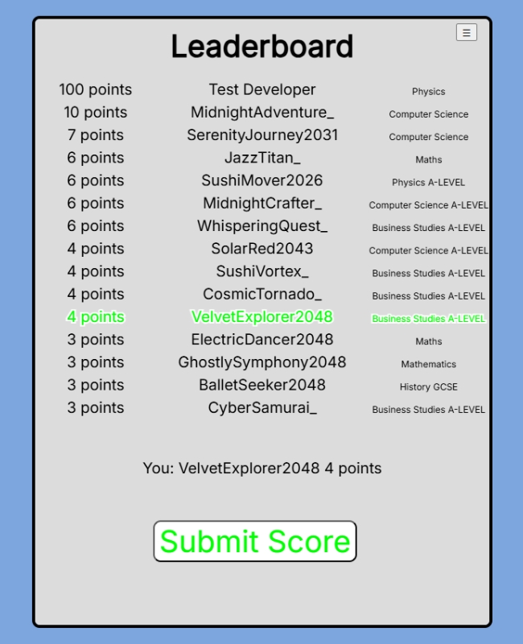

# Computle


Computle is an interactive learning program originally aimed at A-Level Computer Science students, hence the name "Computle." Since its inception, it has expanded to support a variety of subjects across different educational levels, making learning more engaging and enjoyable.

## Features

- 🎮 **Interactive Learning** - Play an engaging game while reinforcing knowledge.
- 📚 **Multiple Subjects** - Learn topics from Computer Science to Business Studies.
- 📜 **Score Certificates** - Get proof of your achievements with certificates.
- 🔒 **Score Verification** - Ensure the authenticity of your scores and leaderboard rankings.
- 🌍 **Web-Based** - No installation required, play directly in your browser!

## Play the Game

Try out Computle now on GitHub Pages:\
[🔗 Play Now](https://oliverdevscode.github.io/Computle/)

## How to Run Locally

1. Clone the repository:
   ```sh
   git clone https://github.com/OliverDevsCode/Computle.git
   ```
2. Navigate to the project folder:
   ```sh
   cd Computle
   ```
3. Start a local development server using Live Server:
   - If you have VS Code, install the [Live Server extension](https://marketplace.visualstudio.com/items?itemName=ritwickdey.LiveServer) and click "Go Live."
   - Alternatively, run the following command if you have Python installed:
     ```sh
     python -m http.server
     ```
4. Open `http://localhost:8000` in your browser.

## Screenshots

### Home Screen

- A clean and simple homepage with subject selection.

### Gameplay

- Solve the word by typing on your keyboard.

### Pause Menu

- Use the pause menu to access other features.

### Score Verification

- Verify that a score certificate is genuine and corresponds to the leaderboard entry, ensuring authenticity and protecting user anonymity.

### Leaderboard

- Compete with others and track high scores.

### Score Certificate

- Receive a certificate to share with others by exporting your score.

## Contributing

Contributions are welcome! Feel free to open issues or submit pull requests to improve Computle.

## License

This project is licensed under the Apache License. See the `LICENSE` file for details.

